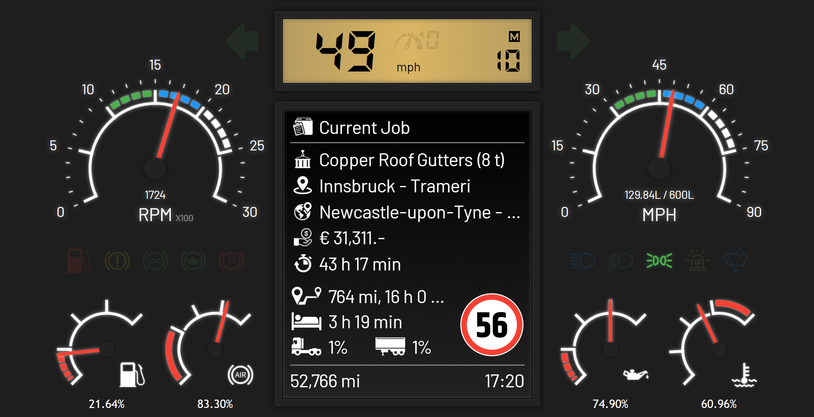

# ETS2/ATS Dynamic Dashboard

A dynamic dashboard created to check all the necessary game information of Euro Truck Simulator 2 or American Truck Simulator.

## Features

- RPM Gauge
- Indicators for various vehicle informations (low fuel, wipers on/off, headlight, low/high beam, parking brake etc)
- Fuel Gauge
- Air Pressure Gauge
- Oil Pressure Gauge
- Water Temperature Gauge
- Speed Gauge
- Fuel percentage left indicator
- Air pressure percentage indicator
- Oil pressure percentage indicator
- Water temperature percentage indicator
- RPM indicator in text format
- Amount of fuel left in Litres
- Digital Speedometer (KMH/MPH)
- Gear Position Indicator
- Toggleable between KMH/MPH
- Left/right indicator
- Current Job Information-
- Current Cargo being transported including weight
- Origin and Destination Location including company names
- Compleletion Reward
- Deadline Time
- Distance left (time included)
- Time before driver falls asleep
- Truck/Trailer damage indicator
- Odometer
- Current game time

## Preview

### Dashboard in Kilometers

### Dashboard in Miles
